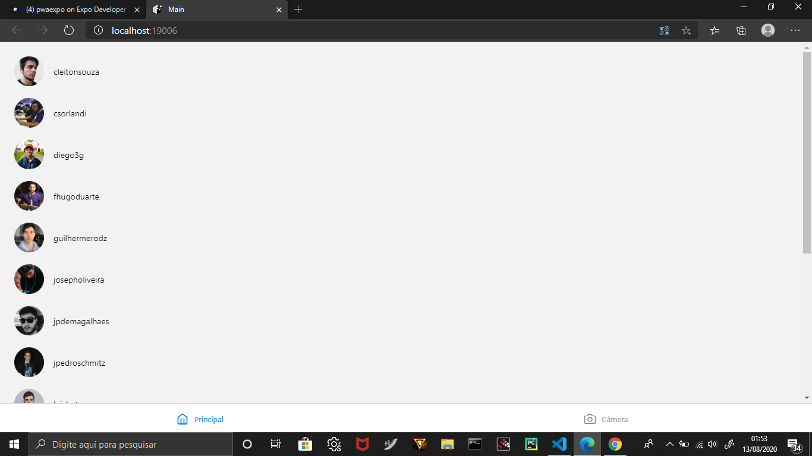
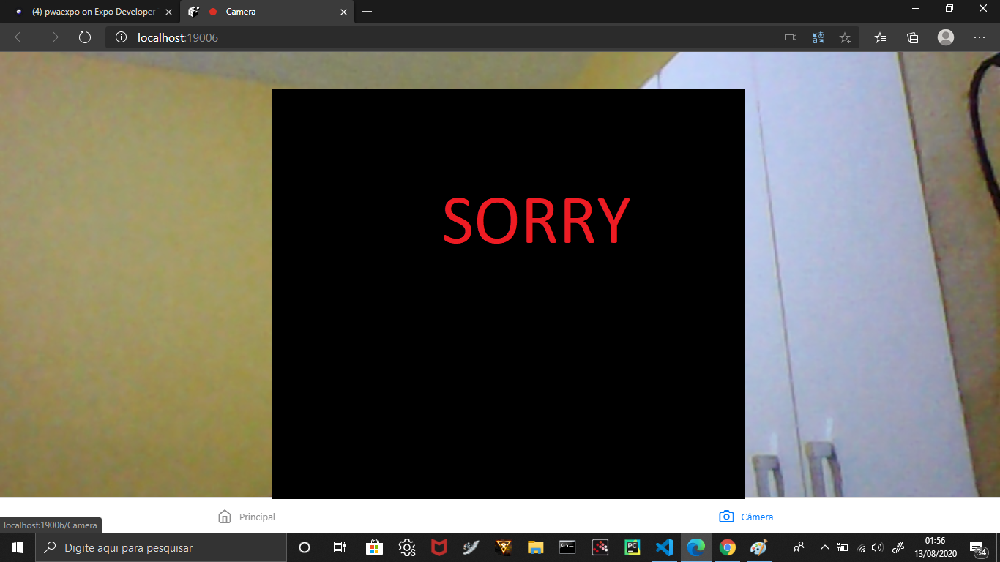

# PWA-Expo

## This repository contains the results of the start of studies on PWA. This small code is able to reflect the essence of this concept, which in this case uses functionalities of a mobile device on a web page. The project consists of two routes, Main and Camera, where Main contains a user's contact list and the Camera uses the device's camera. This project was done using Expo, React Native and TypeScript.

## The image below is the main screen that contains all the user's contacts. The user information, name and image, which are appearing on the screen were consumed from the github API, they are members of Rocketseat.

## A próxima imagem contém a tela da câmera. Quando o usuário entra nesta tela, o Navegador pedirá permissão da câmera para que a mágica aconteça. Como mencionei no início, este projeto é fruto de estudos sobre PWA, então o que está nessas imagens acontece no celular.

## The information / content for this study was taken from @Rocketseat.

